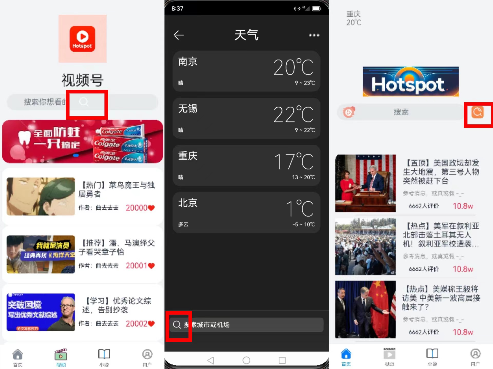
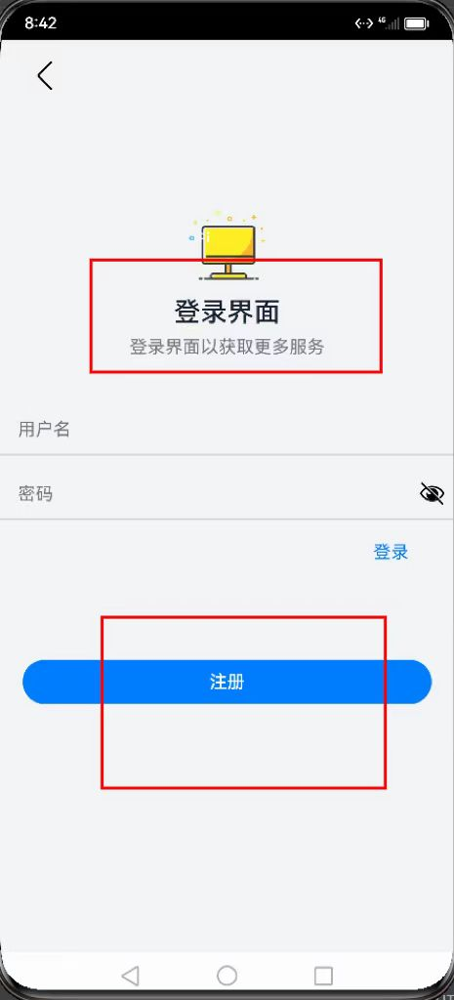
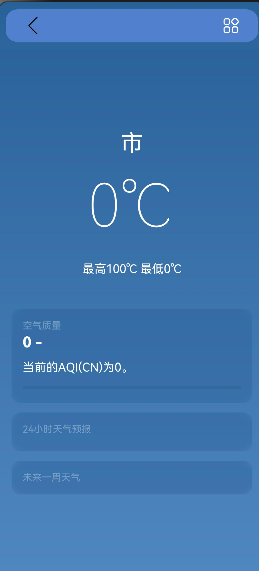
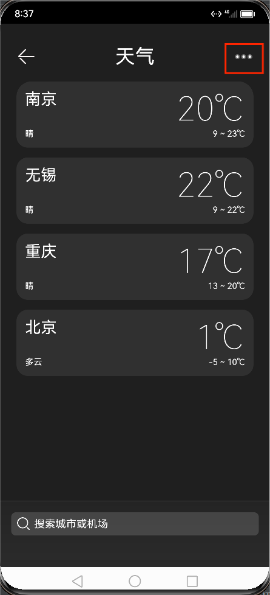

<b>启发式评估</b>

 

<b>目录</b>

<!-- TOC -->

- [1. 项目信息](#1-%E9%A1%B9%E7%9B%AE%E4%BF%A1%E6%81%AF)
    - [1.1. 项目简介](#11-%E9%A1%B9%E7%9B%AE%E7%AE%80%E4%BB%8B)
    - [1.2. 目标人群](#12-%E7%9B%AE%E6%A0%87%E4%BA%BA%E7%BE%A4)
- [2. 启发式评估技术](#2-%E5%90%AF%E5%8F%91%E5%BC%8F%E8%AF%84%E4%BC%B0%E6%8A%80%E6%9C%AF)
    - [2.1. 启发式原则](#21-%E5%90%AF%E5%8F%91%E5%BC%8F%E5%8E%9F%E5%88%99)
    - [2.2. 问题优先级](#22-%E9%97%AE%E9%A2%98%E4%BC%98%E5%85%88%E7%BA%A7)
- [3. 调查结果](#3-%E8%B0%83%E6%9F%A5%E7%BB%93%E6%9E%9C)
- [4. 具体问题域](#4-%E5%85%B7%E4%BD%93%E9%97%AE%E9%A2%98%E5%9F%9F)
    - [4.1. 相同功能的按钮位置不一致](#41-%E7%9B%B8%E5%90%8C%E5%8A%9F%E8%83%BD%E7%9A%84%E6%8C%89%E9%92%AE%E4%BD%8D%E7%BD%AE%E4%B8%8D%E4%B8%80%E8%87%B4)
    - [4.2. 相同功能的模块在不同页面显示不同](#42-%E7%9B%B8%E5%90%8C%E5%8A%9F%E8%83%BD%E7%9A%84%E6%A8%A1%E5%9D%97%E5%9C%A8%E4%B8%8D%E5%90%8C%E9%A1%B5%E9%9D%A2%E6%98%BE%E7%A4%BA%E4%B8%8D%E5%90%8C)
    - [4.3. 页面描述与页面功能不一致](#43-%E9%A1%B5%E9%9D%A2%E6%8F%8F%E8%BF%B0%E4%B8%8E%E9%A1%B5%E9%9D%A2%E5%8A%9F%E8%83%BD%E4%B8%8D%E4%B8%80%E8%87%B4)
    - [4.4. 缺乏足够的加载状态提示](#44-%E7%BC%BA%E4%B9%8F%E8%B6%B3%E5%A4%9F%E7%9A%84%E5%8A%A0%E8%BD%BD%E7%8A%B6%E6%80%81%E6%8F%90%E7%A4%BA)
    - [4.5. 图标与用户经验认知中的作用不同](#45-%E5%9B%BE%E6%A0%87%E4%B8%8E%E7%94%A8%E6%88%B7%E7%BB%8F%E9%AA%8C%E8%AE%A4%E7%9F%A5%E4%B8%AD%E7%9A%84%E4%BD%9C%E7%94%A8%E4%B8%8D%E5%90%8C)
    - [4.6. 天气界面主要功能隐藏在二级菜单中](#46-%E5%A4%A9%E6%B0%94%E7%95%8C%E9%9D%A2%E4%B8%BB%E8%A6%81%E5%8A%9F%E8%83%BD%E9%9A%90%E8%97%8F%E5%9C%A8%E4%BA%8C%E7%BA%A7%E8%8F%9C%E5%8D%95%E4%B8%AD)
    - [4.7. 评论窗口影响视频的正常播放](#47-%E8%AF%84%E8%AE%BA%E7%AA%97%E5%8F%A3%E5%BD%B1%E5%93%8D%E8%A7%86%E9%A2%91%E7%9A%84%E6%AD%A3%E5%B8%B8%E6%92%AD%E6%94%BE)
    - [4.8. 天气并没有展示天气图标](#48-%E5%A4%A9%E6%B0%94%E5%B9%B6%E6%B2%A1%E6%9C%89%E5%B1%95%E7%A4%BA%E5%A4%A9%E6%B0%94%E5%9B%BE%E6%A0%87)

<!-- /TOC -->
## 小组成员

| 姓名     | 学号        |
| ------ | --------- |
| 曲廷锌 | 211250183 |
| 马志学    | 211250232 |
| 王渤元    | 211250225 |

# 1. 项目信息

## 1.1 项目简介

> HotSpot是一款基于HarmonyOS开发的综合性移动端浏览器应用，集成了搜索、新闻、天气预报、视频播放、小说阅读等功能。

## 1.2 目标人群
1) 移动端综合功能需求用户
2) 寻求全方位信息的用户

# 2. 启发式评估技术
> 在此次评估中，使用基于Jakob Nielsen提供的启发式评估可用性方法进行。我们使用了如下十种启发式原则，重点关注HotSpot的核心功能。本次评估的目标是通过以下十种启发式原则找出该系统中的可用性缺陷。

## 2.1 启发式原则

| 序号  | 启发式原则                        |
| --- | ---------------------------- |
| 1   | ***系统状态可见***（可视性原则）          |
| 2   | ***系统与现实世界的匹配***（环境贴切原则）     |
| 3   | ***用户可控性/用户自由***（撤消重做原则）     |
| 4   | ***统一和标准***（一致性原则）           |
| 5   | ***防错性***（防错原则）              |
| 6   | ***识别胜于回忆***（易取原则）           |
| 7   | ***使用起来灵活高效***（灵活高效原则）       |
| 8   | ***美观简洁***（易读性原则）            |
| 9   | ***帮助用户识别、诊断和从错误中恢复***（容错原则） |
| 10  | ***帮助和文档***（人性化帮助原则）         |

## 2.2 问题优先级

### 2.2.1 严重等级

| 等级  | 定义                                                      |
| --- | ------------------------------------------------------- |
| 0   | 违反了启发式，但似乎不是可用性问题。                                      |
| 1   | 浅层可用性问题:可能很容易被用户克服或极少发生。不需要在下一个版本中修复，除非有额外的时间。          |
| 2   | 次要的可用性问题:可能更频繁发生或更难以克服。修复这个问题应该在下一个版本中优先考虑。             |
| 3   | 主要可用性问题:频繁且持续地发生，或者用户可能无法或不知道如何解决问题。重要的是要修复，所以应该给予高优先级。 |
| 4   | 可用性灾难:严重影响产品的使用，用户无法克服。必须在产品发布之前解决这个问题。                 |

### 2.2.2 修复难易度

| 等级  | 定义                                                          |
| --- | ----------------------------------------------------------- |
| 0   | 这个问题很容易解决。可以由一个团队成员在下一个版本之前完成。                              |
| 1   | 问题很容易解决。涉及具体的界面元素和解决方案是明确的。                                 |
| 2   | 这个问题需要一些努力来解决。涉及到接口的多个方面，或者需要开发团队在下一个版本或解决方案发布之前实现更改。       |
| 3   | 可用性问题很难解决。需要集中开发工作在下一个版本之前完成，涉及接口的多个方面。解决方案可能不会立即明显或可能存在争议。 |

# 3. 调查结果

> 在对HotSpot进行启发式评估之后，我们确定了 个违法可用性原则的问题域。

| 序号   | 问题  | 严重等级 | 修复难易度 | 原则序号 | 启发式原则 |
| --- | --- | ---- | ----- | ---- | ----- |
|1|相同功能的按钮位置不一致|2|1|4|一致性原则|
|2|相同功能的模块在不同页面显示不同|2|1|4|一致性原则|
|3|页面描述与页面功能不一致|3|0|2|环境贴切原则|
|4|缺乏足够的加载状态提示|2|1|1|可视性原则|
|5|图标与用户经验认知中的作用不同|3|3|2|环境贴切原则|
|  6  |  天气界面主要功能隐藏在二级菜单中  |   2   |   2   |   6   |   识别胜于回忆   |
|  7  |  评论窗口影响视频的正常播放  |   3   |   3   |   7   |   使用起来灵活高效   |
|  8  |  天气并没有展示天气图标  |   1   |   1   |   8   |   美观简洁   |

# 4. 具体问题域

> 所有指明的问题均在截图中使用红框圈出

## 4.1 相同功能的按钮位置不一致

### 4.1.1 问题描述
> 在该应用中存在多个返回按钮，可是他们有时出现在页面最上，有时出现在页面最下，违反一致性原则。

### 4.1.2 截图

### 4.1.3 建议
> 将返回图标置于同样的位置

## 4.2 相同功能的模块在不同页面显示不同

### 4.2.1 问题描述
> 在该应用中存在多个搜索框，可是他们的搜索图标有时出现在文本输入框中，有时出现在文本输入框外，违反一致性原则。

### 4.2.2 截图

### 4.2.3 建议
> 将搜索图标置于同样的位置

## 4.3 页面描述与页面功能不一致

### 4.3.1 问题描述
> 在注册页面中间有一条提示性文本，可是却显示为登陆页面，与功能不符。

### 4.3.2 截图

### 4.3.3 建议
> 将"登陆页面"改为“注册页面”

## 4.4 缺乏足够的加载状态提示

### 4.4.1 问题描述
> 在首次进入天气页面时会加载天气信息，可是没有足够的提示信息提醒用户正在加载。

### 4.4.2 截图

### 4.4.3 建议
> 在加载过程中添加加载中的动画来向用户展示系统加载状态

## 4.5 图标与用户经验认知中的作用不同

### 4.5.1 问题描述
> 在小说的详细信息页面，左上角的图标往往意味着回到主页面，但是确实返回功能，与用户认知不符，且左下角已经有了返回图标，再有也重复了，让用户不知哪一个才是返回。

### 4.5.2 截图

### 4.5.3 建议
> 将左上角的图标改为返回图标并去掉左下角的返回，或者就将左上角的功能改为回到主页面。

## 4.6 天气界面主要功能隐藏在二级菜单中

### 4.6.1 问题描述
> 在天气功能中可以添加多个城市，这也应该是主要功能之一，但是隐藏在二级菜单之中。

### 4.6.2 截图

### 4.6.3 建议
> 用+号图标代表的“添加城市”功能替代...图标代表的二级菜单，并将管理城市功能植入在“添加城市”功能之内。

## 4.7 评论窗口影响视频的正常播放

### 4.7.1 问题描述
> 一般情况下小视频评论区是展示在视频下部的窗口，打开时不影响视频继续播放，可以让用户“边刷视频边刷评论”，这里的评论区打开后会遮住视频界面，导致无法正常播放视频。

### 4.7.2 截图

### 4.7.3 建议
> 将评论区设置成上拉式的抽屉，打开评论区时调整视频位置，不更改亮度，保证视频继续播放。

## 4.8 天气并没有展示天气图标

### 4.8.1 问题描述
> 主页右上角的天气，留下了天气图标的空位，但是并没有展示当前天气的图标，缺少直观性。

### 4.8.2 截图

### 4.8.3 建议
> 在主页天气处读取数据，展示对应的天气图标。

